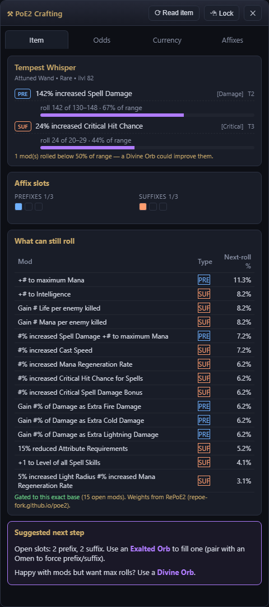
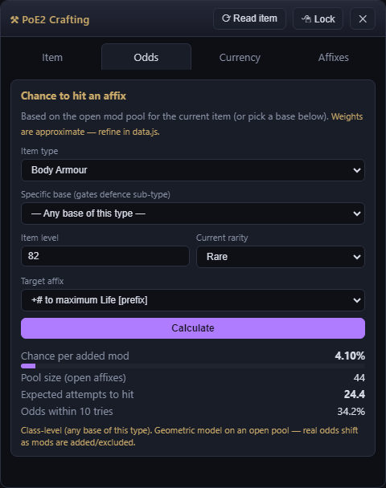
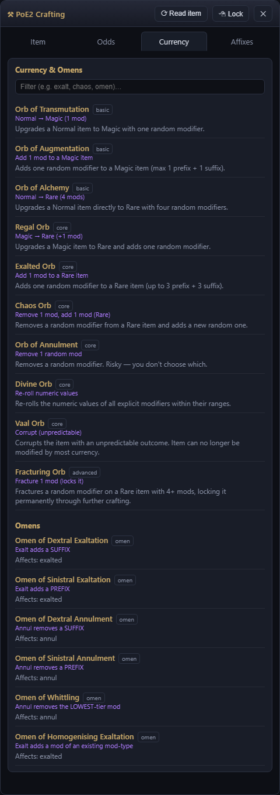

# ⚒ PoE2 Crafting Overlay

A free, transparent overlay for **Path of Exile 2**. Copy an item in-game and the
overlay instantly shows its mods, **roll quality**, **what can still roll** (gated
to your exact base), the **odds**, what every currency/omen does, and a suggested
next crafting step.

### ⬇ [Download for Windows](https://github.com/T-Biggs/poe2mod/releases/latest)

Or visit the **[landing page](https://t-biggs.github.io/poe2mod/)**. Free, auto-updating,
no account, no setup.

## Screenshots

| Live item analysis | Odds calculator | Currency reference |
|:---:|:---:|:---:|
|  |  |  |

## How to use

1. Run PoE2 in **Borderless / Windowed Fullscreen**.
2. (Recommended) Enable **Options → UI → Advanced Mod Descriptions** in PoE2.
3. Hover an item and press **`Ctrl+C`** — the overlay reads it automatically.

| Hotkey | Action |
| --- | --- |
| `Ctrl+C` *(in game)* | Copy the hovered item — overlay updates automatically |
| `Ctrl+Alt+O` | Show / hide the overlay |
| `Ctrl+Alt+X` | Click-through (let clicks pass to the game) |

## Is it safe? (Yes)

It only reads your **clipboard** and draws a window — it never reads game memory,
injects code, or automates input. Mod data comes from the community
[RePoE2](https://repoe-fork.github.io/poe2/) project and refreshes automatically.

## License

[MIT](LICENSE). Not affiliated with Grinding Gear Games; PoE2 content is property of GGG.

This is the public distribution repo (site, data, and downloads). Source is maintained privately.
